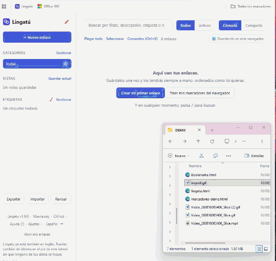
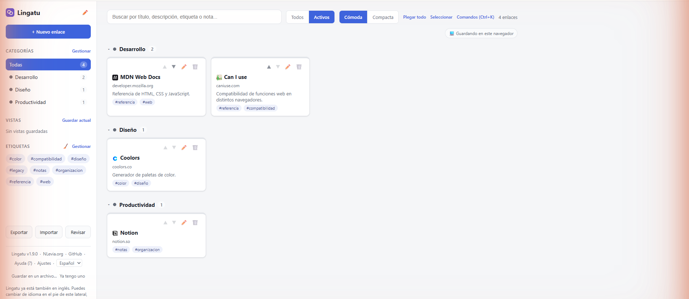
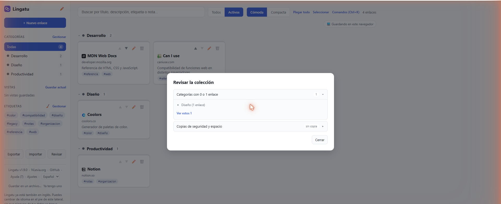

[English](README.md)

# Lingatu

Tus marcadores, en un archivo que es tuyo — sin cuenta, sin nube, sin servidor.

### [**Probar la demo en vivo →**](https://nlevia.org/lingatu/app/)

Sin instalación, sin registro — se abre y ya está.

## Por qué Lingatu

- **Un solo archivo HTML, nada más.** Sin servidor, sin paso de compilación, sin framework, sin ninguna dependencia externa. Abres `lingatu.html` y funciona.
- **Sin cuenta, sin registro.** Tus enlaces viven en el `localStorage` de tu navegador, no en el servidor de nadie.
- **Funciona sin conexión**, salvo los iconos de favicon (ver [Privacidad](#privacidad) más abajo).
- **Importa desde cualquier navegador**: arrastra sobre la página el HTML de marcadores que exporta cualquier navegador.
- **Licencia MIT.**

## Funcionalidades

- Gestión completa de enlaces: crear, editar, borrar, duplicar, reordenar manualmente con arrastrar y soltar, favicon automático.
- Categorías y etiquetas con colores e iconos propios, reordenables a mano.
- Búsqueda con operadores — `cat:`, `#etiqueta`, `site:`, `is:activo`/`is:inactivo`, `"frase exacta"`, `-` para negar.
- Vistas guardadas: una combinación reutilizable de filtros, o una lista concreta de enlaces elegidos a mano.
- Notas por enlace, escritas y leídas en Markdown formateado.
- Panel de limpieza que detecta duplicados, URLs inválidas, enlaces sin etiquetar y más — sin modificar nada.
- Paleta de comandos (`Ctrl+K`/`Cmd+K`) que busca a la vez acciones, enlaces, categorías, vistas y etiquetas.
- Selección múltiple con acciones en lote, modo oscuro y atajos de teclado.

Detalle funcional y técnico completo en [`docs/ESPECIFICACIONES.md`](docs/ESPECIFICACIONES.md).

## Puesta en marcha

1. Descarga [`lingatu.html`](lingatu.html).
2. Ábrelo en tu navegador (doble clic, o arrástralo a una pestaña).
3. Para traer tus marcadores existentes, expórtalos como HTML desde tu navegador y arrastra ese archivo sobre la página.

## Extensión de navegador

La extensión opcional **[Lingatu Connector](https://chromewebstore.google.com/detail/lingatu-connector/kljfmjpiflhpedkbcldmkomhmepnimdl)** añade un botón de "guardar esta pestaña" con un clic: captura la URL, el título y la descripción de la pestaña activa, comprueba si ya está en Lingatu y, si no, abre el formulario de alta precargado.

Como `lingatu.html` se ejecuta en `file://`, la extensión necesita un permiso adicional tras instalarla:

1. Ve a `chrome://extensions` (o `edge://extensions`).
2. Abre la tarjeta de **Lingatu Connector** → **Detalles**.
3. Activa **"Permitir acceso a las URL de archivo"**.

Sin este paso, la extensión no puede detectar ni abrir tu `lingatu.html`.

## Privacidad

- Tus datos viven en el `localStorage` de tu navegador. No se envía nada a ningún servidor que controle Lingatu.
- **Una excepción declarada**: los favicons se piden a `google.com/s2/favicons`, así que el dominio de cada enlace que guardas se envía a Google en cada carga de página. Sin conexión, los enlaces se siguen viendo, solo que sin icono.

## Preguntas frecuentes

**¿Dónde están mis datos?**
En el `localStorage` de tu navegador, ligados al perfil desde el que abriste `lingatu.html`.

**¿Qué pasa si borro los datos del navegador?**
Pierdes tu colección, salvo que hayas exportado antes una copia. Lingatu avisa antes de que pase demasiado tiempo sin exportar, pero la única copia que sobrevive a un borrado de datos del navegador es la que exportaste tú.

**¿Funciona sin conexión a internet?**
Sí — todo funciona sin conexión salvo los iconos de favicon, que necesitan conexión para cargar.

**¿Puedo usarlo en varios equipos?**
No hay sincronización integrada. Exporta un archivo JSON desde un equipo e impórtalo en el otro para trasladar tu colección.

## Contribuir

Las contribuciones son bienvenidas. El proyecto sigue una restricción de arquitectura estricta — un único archivo HTML autocontenido, sin paso de compilación, sin dependencias, sintaxis estilo ES5 — documentada por completo en [`docs/ESPECIFICACIONES.md`](docs/ESPECIFICACIONES.md). Léela antes de tocar `lingatu.html`.

## Licencia

[MIT](LICENSE) © 2026 A. Vazquez ([NLevia.org](https://www.nlevia.org))
